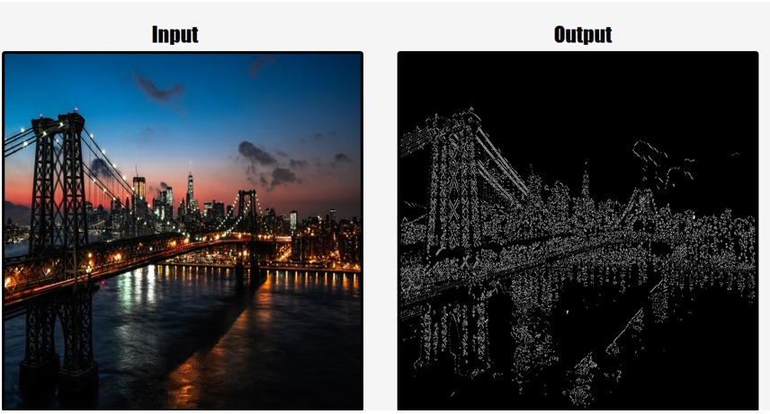
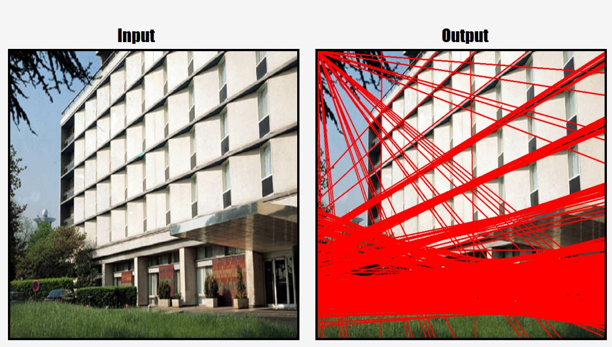
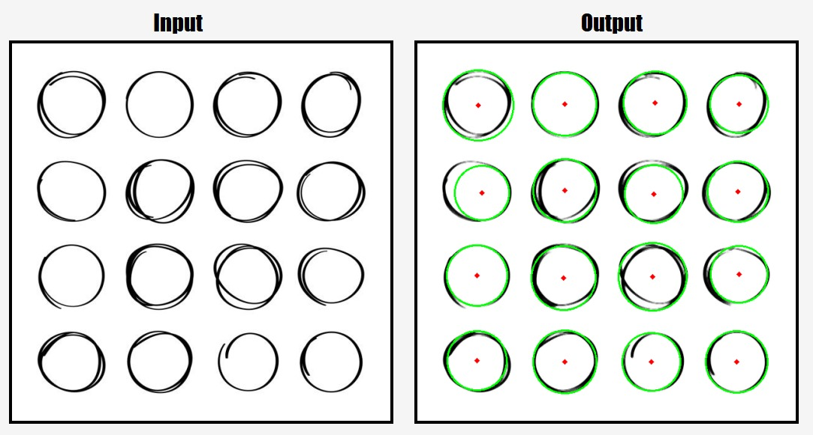
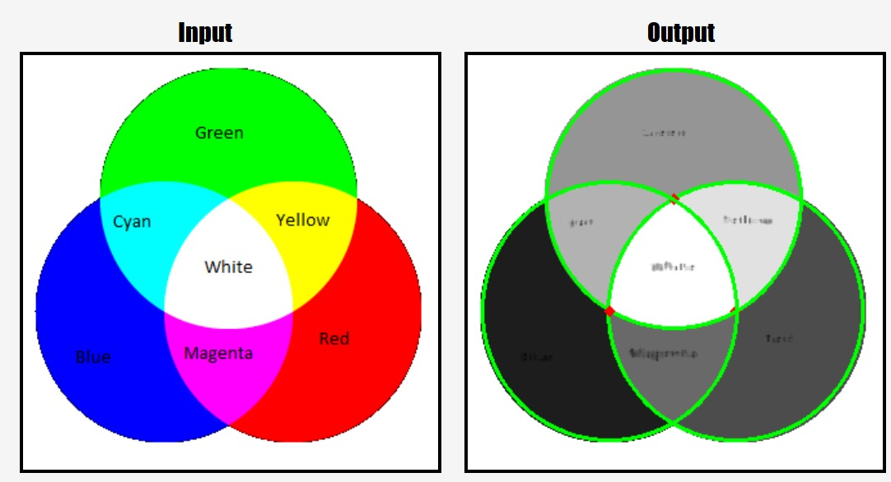
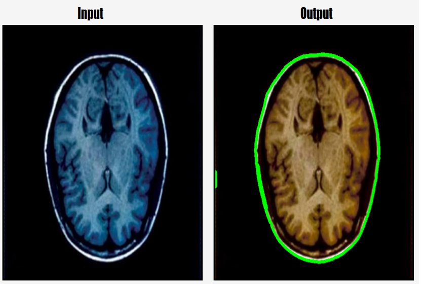
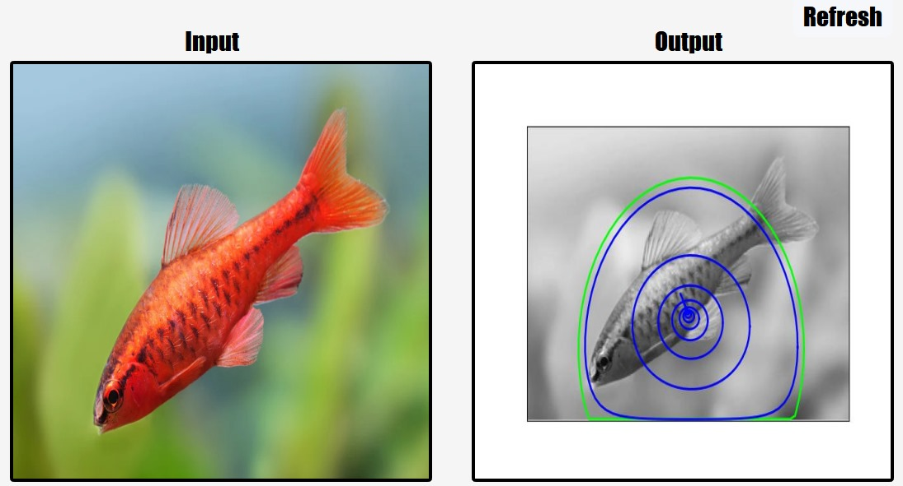

# Edge and Boundary Detection (Hough Transform and SNAKE)

## Overview
This project involves edge and boundary detection using various computer vision techniques such as the Canny edge detector and Hough Transform for detecting lines, circles, and ellipses, as well as the Active Contour Model (SNAKE) for contour evolution.

### Tasks Implemented

#### A) Tasks to Implement

1. **Edge Detection and Shape Detection**
    - **Canny Edge Detection:** 
      
      

      
    - **Hough Transform for Line Detection:**
        - Line detection using parametric representation in θ and ρ space.
        
      
      
    - **Hough Transform for Circle Detection:**
        - Circle detection with a 3-dimensional parameter space for center coordinates and radius.
        
      
      
      
    - **Hough Transform for Ellipse Detection:**
        - Ellipse detection with a 5-dimensional parameter space for center coordinates, major and minor axes' lengths, and orientation angle.
        
      

2. **Active Contour Model (SNAKE)**
    - **Initialize Contour:**
        - Initialized the contour for segmentation using circle, rectangle, or points.
    - **Energy Functional:**
        - Calculated the energy for the given image and contour using image term, contour term, and curvature term.
    - **Gradient Functional:**
        - Calculated the gradient of the energy with respect to the contour.
    - **Evolve Contour:**
        - Updated the contour using a greedy algorithm that minimizes the energy functional.
    - **Freeman Chain Code:**
        - Converted the contour points into chain codes using the Freeman chain code algorithm.
        
      


### Instructions to Run the Code

1. **Requirements:**
    - Python 3.x
    - NumPy
    - OpenCV
    - Matplotlib
    - Scikit-image

2. **Setup:**
    - Ensure all required libraries are installed.
    - Place the given images in the `images/` directory.

3. **Running the Scripts:**
    - To run the program for edges and shapes and apply the Active Contour Model:
      ```bash
      python task3.py
      ```
### Team Members
- **Ibrahim Emad** 
- **Ahmed Khaled**
- **Arsany Maged** 
- **Omar Atef** 
- **Kyrollos Emad** 
